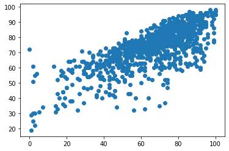
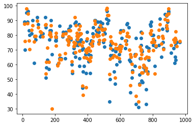

# Analysis and prediction of water quality and water quality index

## Abstract

An attempt has been made to develop models for predicting water quality index (WQI) and Water Quality Class(WQC), using eight water quality parameters like pH, dissolved oxygen, biochemical oxygen demand, electrical conductivity, nitrogen,phosphorus and turbidity collected by the The WA State Department of Ecology's River and Stream Monitoring Program.With increasing pollution in water, predicting water quality with high precision has become very important.In this project, different supervised machine learning models and deep learning models were used to predict water quality more accurately .WHO standards have been used to perform the classification.The proposed methodologies provides enough accuracy to be implemented in real life.

**About:**

The water quality index (WQI) is an important tool to determine the drinking water quality in urban, rural and industrial areas. WQI is defined as an index reflecting the composite influence of different water quality parameters which is considered and taken for calculation of water quality index. The WQI measures the scope, frequency, and amplitude of water quality exceedances and then combines the three measures into one score. This calculation produces a score between 0 and 100. The higher the score the better the quality of water. The scores are then ranked into five categories.This is very fundamental and is an important part of urban planning.WQI scores are computed for each public water supply system that has been sampled in a sampling season. The same variables are used in the computation of the WQI for all public water supply systems.

## Flow Chart

## Data Collection
<https://www.waterqualitydata.us/>

The Dimension of the dataset: 971 rows and 15 columns

**List of Important Features in the Dataset:**
- WQI FC
- WQI Oxygen
- WQI pH
- WQI TSS (total suspended sediment)
- WQI Temp (temperature)
- WQI TPN (nitrogen)
- WQI TP (phosphorus)
- WQI Turb (turbidity)

**Dependence of WQI on TSS**

**Feature Engineering Methods Used on the raw dataset:**
1. 1-hot encoding     2. Normalization    3.Encoding

Based on designations set by CCME(2005) to classify water based on WQI.
**Class       	 WQI		          Notes**
Excellent	      95-100    	All measurements are within objectives virtually all of the time
Good          	80-94      	Conditions rarely depart from natural or desirable levels
Fair          	65-79     	Conditions sometimes depart from natural or desirable levels
Marginal      	45-64      	Conditions often depart from natural or desirable levels
Poor          	 0-44      	Conditions usually depart from natural or desirable levels**

## Linear Regression : Results
- RMSE : 6.462242048880141
- max_error: 35.70102554961721

**Actual WQI vs Predicted WQI**

## Logistic Regression: Results
- Accuracy  : 0.7474747474747475
- Precision : 0.7585061443932412
- Recall    :  0.5384479717813051

## Decision Tree: Results
- Accuracy  : 0.7121212121212122
- Precision : 0.6902426211377618
- Recall    : 0.5879717813051146

Scope for improvement : The dataset is highly imbalanced. Results will improve drastically with a balanced dataset.

**Author**
Rajarshi Maity 
rajarshimaity3235@gmail.com
